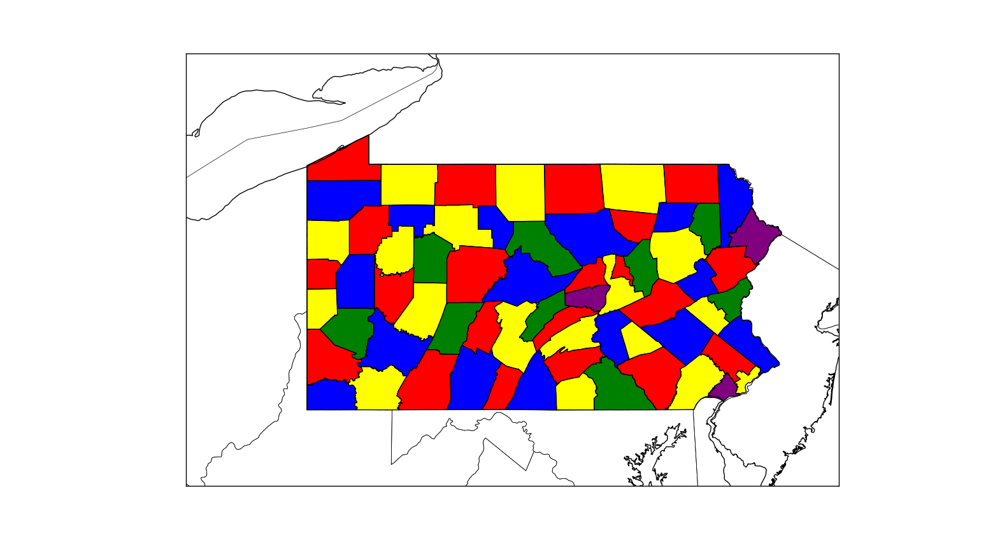
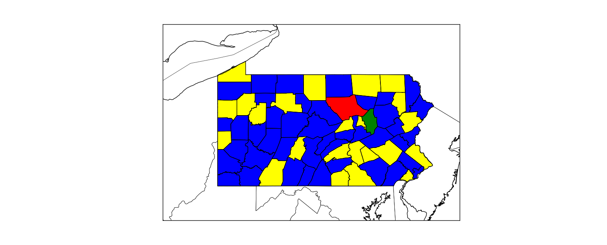

## Doel van de presentatie

Het doel van deze presentatie is het weergeven van onze vordering betreffende het inkleuren van de kaarten

## Beschrijving eerste algoritme

1. We initialiseren alle kleuren op 0.
2. We updaten de kleuren van een parent zolang een van de children dezelfde kleur heeft.
3. Repeat dit proces voor alle counties.

## Resultaat

Het resultaat is het volgende:

<figure>
    
  <figcaption class="make_small2">Fig.1 - Onze kaart </figcaption>
</figure>

## Beschrijving tweede algoritme

Ons algoritme beoogt het volgende:

1. Zoek het land / provincie met de meeste grenzen (edges)
2. Dit land krijgt de eerste kleur
3. Begin met het kleuren van de provincie binnen de shell met de meeste grensen binnen de shell
4. Deze provincie krijgt kleur 2.
5. Elke volgende provincie krijgt ook kleur 2 tenzij dit een "conflict" veroorzaakt.
6. Bij een conflict wordt de kleur de vorige kleur + 1
7. Als alle landen binnen de shell gekleurd zijn dan herhaald dit proces zeg met de volgende shell.

## Resultaat

Het resultaat is dat het proces tot nu toe werkt voor de eerste shell. Bij de tweede shell loopt het tot nu toe vast.

<figure>
    
  <figcaption class="make_small2">Fig.1 - Onze kaart </figcaption>
</figure>

## Vragen

1. Hebben jullie ideëen waarom het algoritme vastloopt na de eerste shell?
2. Hebben jullie concrete suggesties om dit te verbeteren (e.g. welke "checks" moet we nog extra inbouwen)?
